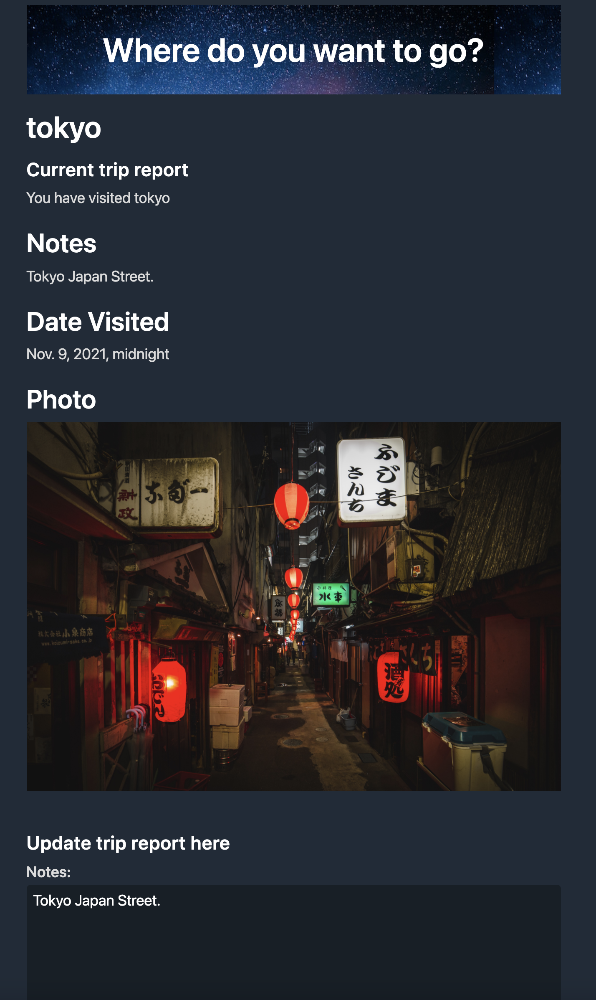

# Travel Wishlist

## General Information

An application that allows users to save a list of places they would like to visit as well as a list of places they have visited.

## Technologies Used

- Django
- Python3
- Water CSS

## Installation

Install project packages

```bash
  pip install -r requirements.txt
```

## Features

Based on the provided data:

- Users can input the names of places they wish to visit.
- Users can mark places they've visited by clicking the Visited button.
- Users can add notes, dates, and photos to places they've visited.

## Screenshots


